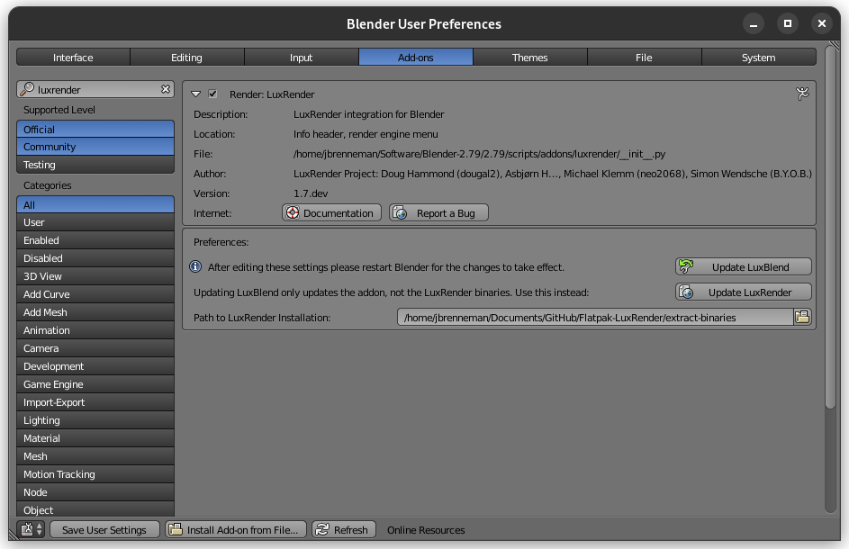
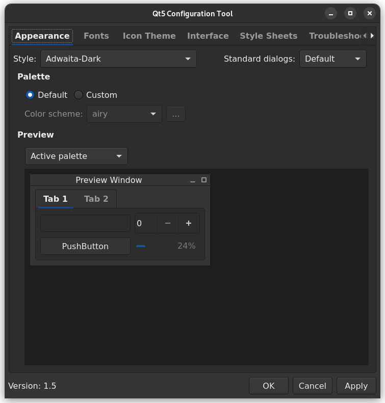

# LuxRender Flatpak


This repository provides the sources for building the LuxRender Flatpak package.


# Getting Started

Once you have compiled the system, check the [Wiki page](https://github.com/rrubberr/Flatpak-LuxRender/wiki) for in-depth information.

Install the updated version of [LuxBlend25](https://github.com/rrubberr/Flatpak-LuxBlend25) for Blender 2.79 integration.

Download and try a [test scene](https://github.com/rrubberr/Flatpak-LuxRender-Scenes).


## Dependencies

Building LuxRender requires Flatpak and Flatpak builder. To run the LuxRender UI, Qt6 core, dbus, gui, imageformats, and widgets are required.

Other libraries linked include fftw3, freetype, and png.

On a Debian based distribution:

```sh
sudo apt install flatpak flatpak-builder qt6-base-dev qt6-image-formats-plugins libfftw3-3 libfreetype6 libpng16-16
```

On a Fedora based distribution:

```sh
sudo dnf install flatpak flatpak-builder qt6-qtbase qt6-qtimageformats fftw freetype libpng
```
On an Arch based distribution:

```sh
 sudo pacman -S --needed flatpak flatpak-builder qt6-base qt6-imageformats fftw freetype2 libpng
```


## Building the Flatpak

Clone this GitHub repository.

```sh
git clone --recursive https://github.com/rrubberr/Flatpak-LuxRender -b FeatureRemoval luxrender && cd luxrender
```

Build the LuxRender package using Flatpak Builder.

```sh
flatpak-builder --install-deps-from=flathub --force-clean .build-dir org.luxrender.luxrenderui.yml
```


## Collecting Binaries

In order to use LuxRender, the compiled binaries must be collected.

From the "luxrender" directory, run the following command:

```sh
sh gather-binaries/gather-binaries.sh
```

This will populate the gather-binaries folder with everything needed to use LuxRender. This folder can now be renamed or moved anywhere.

After installing [LuxBlend25](https://github.com/rrubberr/Flatpak-LuxBlend25), point the addon to this directory to enable Blender interoperability.




## Setting a Qt6 Theme

Your system will likely apply an incorrect theme to LuxRender. To remedy this, install the Qt6 Configuration Tool and adwaita-qt.

On a Debian based distribution:

```sh
sudo apt install qt6ct adwaita-qt
```

On a Fedora based distribution:

```sh
sudo dnf install qt6ct adwaita-qt6
```

On an Arch based distribution:

```sh
sudo pacman -S --needed qt6ct && yay -S adwaita-qt6-git
```

Set the system Qt6 theme to "Adwaita" or "Adwaita Dark" as shown in the included screenshot. Adjust the typeface and size to your taste in the "Fonts" tab.




## New Features

### LuxRays

* New FlatPak build system with GCC 15 support.

### LuxRender

* New FlatPak build system with GCC 15 support.
* New QT6 based GUI with theming support.
* Added the ability to select more than 32 threads in the GUI.
* Added a fifth decimal place to certain post-process effects for finer tuning.
* Removed support for LuxCoreRender and OpenCL.
* If these features are desired, consult the [LuxCoreRender project page](https://github.com/LuxCoreRender).

### LuxBlend

* Added the ability to set the mesh accelerator (QBVH, KDTree, etc.) per-mesh in the Blender mesh data panel.
* Removed support for LuxCoreRender rendering engines.
* If these features are desired, consult the [BlendLuxCore project page](https://github.com/luxcorerender/blendluxcore).

## Known limitations

The LuxRender Flatpak is intended for use with modern Linux systems, and has been confirmed to build on a wide variety of current distributions from Debian and Ubuntu, to Fedora and RHEL, and is developed on Gentoo.

Support for Windows and MacOS is not planned, although there is no reason the system could not still be compiled for those systems.

Users of older Linux systems, Mac OSX, and Windows, should use the legacy [LuxRender 1.6 binaries](https://wiki.luxcorerender.org/Previous_Version).
